# Assistant UI Component Inheritance Diagram

```mermaid
graph TD
    %% Top-level Provider
    AssistantProvider[AssistantProvider]
    AssistantModal[AssistantModal]
    
    %% Thread Components
    Thread[Thread]
    ThreadWelcome[ThreadWelcome]
    Composer[Composer]
    UserMessage[UserMessage]
    EditComposer[EditComposer]
    AssistantMessage[AssistantMessage]
    
    %% Shared Components
    TooltipIconButton[TooltipIconButton]
    BranchPicker[BranchPicker]
    ThreadScrollToBottom[ThreadScrollToBottom]
    MarkdownText[MarkdownText]
    ToolFallback[ToolFallback]
    MessageError[MessageError]
    AgentActivityInline[AgentActivityInline]
    
    %% Attachment Components
    UserMessageAttachments[UserMessageAttachments]
    ComposerAttachments[ComposerAttachments]
    ComposerAddAttachment[ComposerAddAttachment]
    AttachmentUI[AttachmentUI]
    AttachmentRemove[AttachmentRemove]
    AttachmentThumb[AttachmentThumb]
    AttachmentPreview[AttachmentPreview]
    AttachmentPreviewDialog[AttachmentPreviewDialog]
    
    %% Internal Components
    AssistantActionBar[AssistantActionBar]
    UserActionBar[UserActionBar]
    ComposerAction[ComposerAction]
    ThreadSuggestions[ThreadSuggestions]
    
    %% Inheritance/Usage Relationships
    AssistantProvider --> AssistantModal
    AssistantModal --> Thread
    
    Thread --> ThreadWelcome
    Thread --> Composer
    Thread --> UserMessage
    Thread --> EditComposer
    Thread --> AssistantMessage
    
    AssistantMessage --> MarkdownText
    AssistantMessage --> ToolFallback
    AssistantMessage --> MessageError
    AssistantMessage --> BranchPicker
    AssistantMessage --> AgentActivityInline
    AssistantMessage --> AssistantActionBar
    
    AssistantActionBar --> TooltipIconButton
    
    UserMessage --> UserMessageAttachments
    UserMessage --> BranchPicker
    UserMessage --> UserActionBar
    
    UserActionBar --> TooltipIconButton
    
    Composer --> ComposerAttachments
    Composer --> ComposerAddAttachment
    Composer --> ThreadScrollToBottom
    Composer --> ComposerAction
    
    ComposerAction --> ComposerAddAttachment
    ComposerAction --> TooltipIconButton
    
    EditComposer --> TooltipIconButton
    
    ThreadWelcome --> ThreadSuggestions
    
    BranchPicker --> TooltipIconButton
    
    ThreadScrollToBottom --> TooltipIconButton
    
    UserMessageAttachments --> AttachmentUI
    ComposerAttachments --> AttachmentUI
    ComposerAddAttachment --> TooltipIconButton
    
    AttachmentUI --> AttachmentPreviewDialog
    AttachmentUI --> AttachmentRemove
    AttachmentUI --> AttachmentThumb
    
    AttachmentPreviewDialog --> AttachmentPreview
    AttachmentRemove --> TooltipIconButton
    
    MarkdownText --> TooltipIconButton
    
    %% Styling
    classDef topLevel fill:#e1f5ff,stroke:#01579b,stroke-width:3px
    classDef threadComponent fill:#f3e5f5,stroke:#4a148c,stroke-width:2px
    classDef sharedComponent fill:#e8f5e9,stroke:#1b5e20,stroke-width:2px
    classDef attachmentComponent fill:#fff3e0,stroke:#e65100,stroke-width:2px
    classDef internalComponent fill:#fce4ec,stroke:#880e4f,stroke-width:1px
    
    class AssistantProvider,AssistantModal topLevel
    class Thread,ThreadWelcome,Composer,UserMessage,EditComposer,AssistantMessage threadComponent
    class TooltipIconButton,BranchPicker,ThreadScrollToBottom,MarkdownText,ToolFallback,MessageError,AgentActivityInline sharedComponent
    class UserMessageAttachments,ComposerAttachments,ComposerAddAttachment,AttachmentUI,AttachmentRemove,AttachmentThumb,AttachmentPreview,AttachmentPreviewDialog attachmentComponent
    class AssistantActionBar,UserActionBar,ComposerAction,ThreadSuggestions internalComponent
```

## Component Descriptions

### Top-Level Components
- **AssistantProvider**: Provides runtime context and wraps children with AssistantModal
- **AssistantModal**: Root container that renders the Thread component

### Thread Components
- **Thread**: Main conversation container that orchestrates all message and composer components
- **ThreadWelcome**: Welcome screen shown when thread is empty
- **Composer**: Input area for composing new messages
- **UserMessage**: Displays user messages with attachments and action bar
- **EditComposer**: Inline editor for editing existing messages
- **AssistantMessage**: Displays assistant responses with markdown, tools, and actions

### Shared Components
- **TooltipIconButton**: Reusable button component with tooltip support
- **BranchPicker**: Component for navigating between conversation branches
- **ThreadScrollToBottom**: Button to scroll thread to bottom
- **MarkdownText**: Renders markdown content with syntax highlighting
- **ToolFallback**: Displays tool call information when tools are used
- **MessageError**: Displays error messages in conversation
- **AgentActivityInline**: Shows agent activity timeline

### Attachment Components
- **UserMessageAttachments**: Container for attachments in user messages
- **ComposerAttachments**: Container for attachments in composer
- **ComposerAddAttachment**: Button to add attachments
- **AttachmentUI**: Main attachment display component
- **AttachmentRemove**: Button to remove attachments
- **AttachmentThumb**: Thumbnail preview of attachments
- **AttachmentPreview**: Full-size preview of attachments
- **AttachmentPreviewDialog**: Dialog wrapper for attachment preview

### Internal Components
- **AssistantActionBar**: Action bar for assistant messages (copy, reload)
- **UserActionBar**: Action bar for user messages (edit)
- **ComposerAction**: Action buttons in composer (send, cancel, add attachment)
- **ThreadSuggestions**: Suggested prompts in welcome screen

